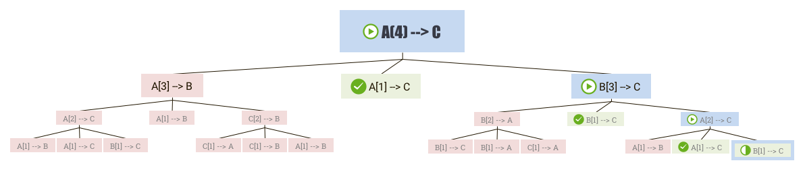
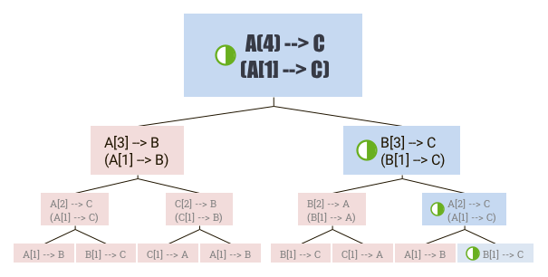

# Tower of Hanoi

### Description
English: https://en.wikipedia.org/wiki/Tower_of_Hanoi  
Chinese: https://zh.wikipedia.org/wiki/%E6%B1%89%E8%AF%BA%E5%A1%94

### Content
python/  
├── 1_basic.py     (Basic version: trace)  
└── 2_boundary.py  (Enhanced version: trace, boundary)

### Analysis
  To complete "2_boundary.py", it need deeper undersatanding of recursion.  

  At first, I thought it is a "ternary tree":
  
  From which, you can see when a new layer should be started, and when it is end.
   
  But actually the middle node can be omitted, and it could be a "binary tree":
  
  Then each "right node" can be either starting or ending point.
